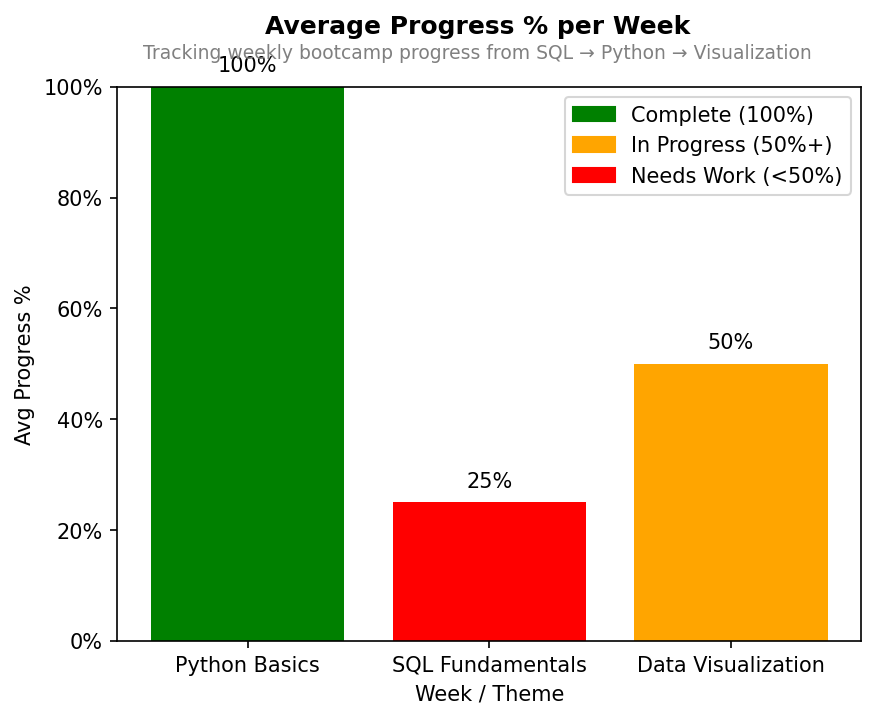

# Bootcamp Progress Tracker (SQL → Python → Visualization)



**What it is:**  
End-to-end analytics pipeline:  
- SQLite database with normalized tables (`weeks`, `milestones`, `progress`)  
- SQL queries for aggregation & KPIs  
- Python (`sqlite3`) for data pull  
- Matplotlib chart with percent labels, conditional colors, and legend  
- Auto-exports to PNG & PDF

## Quick Start
```bash
python bootcamp_chart.py

